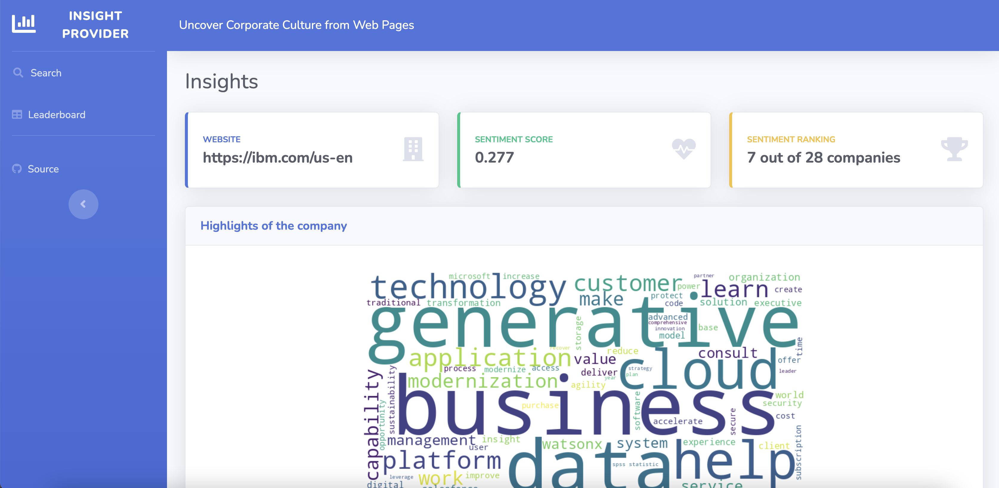
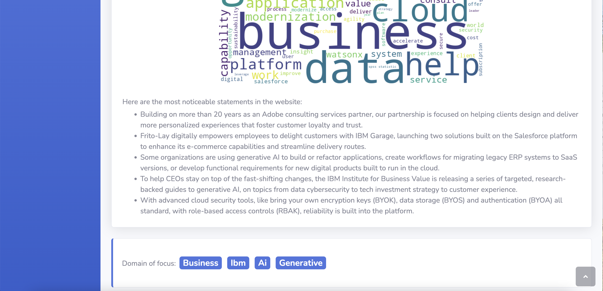
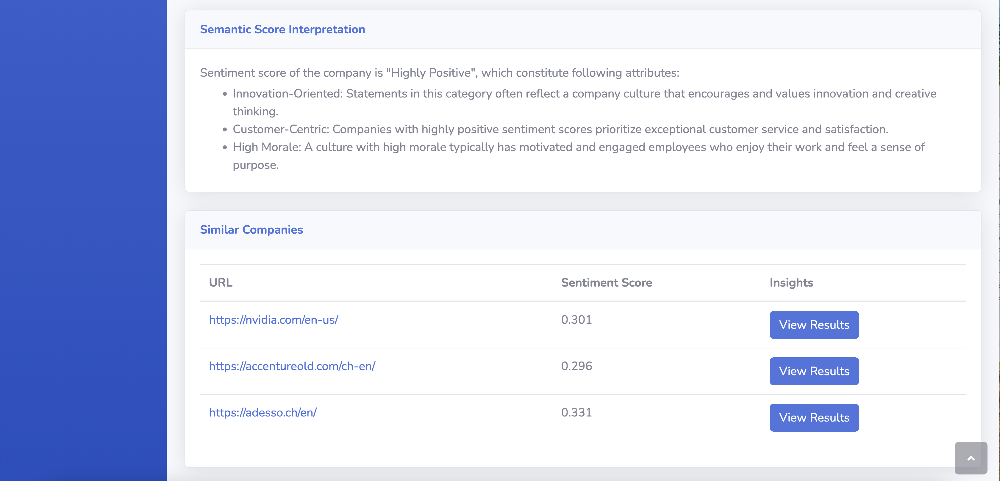

# Insight Pro [](https://www.insight-pro.info/) [](https://www.gnu.org/licenses/gpl-3.0) [](https://doi.org/10.5281/zenodo.8418646) 

Welcome to Insight Pro (Insight Provider), a powerful web service that delivers in-depth insights about companies'
culture and environment based on their website content. By utilizing cutting-edge Natural Language Processing (NLP) and Artificial Intelligence (AI)
techniques, Insight Pro extracts valuable information from company websites and offers a range of features to help you
gain a better understanding of businesses.

## Online Availability

You can access the current version of Insight Pro at [www.insight-pro.info](https://www.insight-pro.info).

## Overview

Insight Pro empowers you with valuable information about companies across various dimensions:

- **Sentiment Analysis:** Our service categorizes the content on a company's website as positive, negative, or neutral.
  Sentiment analysis assigns scores to textual information, with higher scores indicating attributes like innovation,
  customer-centric attitudes, and strong moral values. The service not only provides a sentiment score but also
  interprets it and ranks the company among others in the database.

- **Highlights:** Gain a quick understanding of a company's focus areas with a word cloud featuring prominent keywords.
  Additionally, Insight Pro identifies the top five most significant statements on the website using Statistical
  Summarization techniques.

- **Domain of Focus:** Discover the technical directions or high-level abstract objectives of a company. Insight Pro
  employs Topic Modeling techniques to infer the domains that a company specializes in.

- **Similar Companies:** Uncover competitors and industry peers for a better grasp of a company's position in the
  market. Our service suggests similar companies using an advanced Item-Based Collaborative Recommender System. Our
  service employs an advanced Item-Based Collaborative Recommender System that continually adapts, learning new
  associations as the database expands.

- **Leaderboard:** Access a list of the top ten companies with the highest sentiment scores, allowing you to identify
  industry leaders.

## Screenshots





## Installation

To run Insight Pro on your own host, make sure you have Python 3.9 or higher installed and follow these steps:

1. Install dependencies by running the following command in your terminal:

   ```bash
   pip install -r requirements.txt
   ```

2. Generate a Django secret key using the following Python code. Add the generated key
   to [secret_template.py](web_insight/secret_template.py), and rename the file to `secret.py`:

   ```python
   import secrets
   secret_key = secrets.token_hex(50)
   print(secret_key)
   ```

3. Set the path to Python in [settings.py](web_insight/settings.py).

4. Create Django database tables by running these commands:

   ```bash
   python manage.py makemigrations analyze
   python manage.py migrate analyze
   python manage.py makemigrations
   python manage.py migrate
   ```

5. Collect static files with the following command:

   ```bash
   python manage.py collectstatic
   ```

6. Finally, start the server by running:

   ```bash
   python manage.py runserver
   ```

Now, you have your own instance of Insight Pro up and running locally.

Feel free to explore and utilize Insight Pro to gain valuable insights into companies' cultures and environments
effortlessly.
